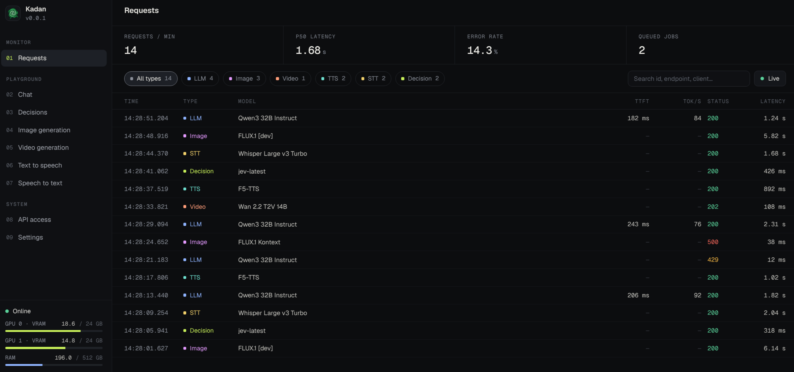
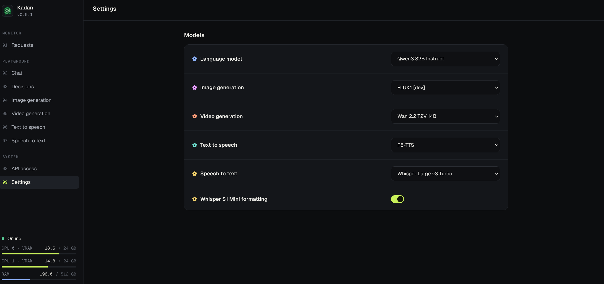

# Kadan

## Overview

Kadan aims to give local agents chat, decisions, image and video generation, and
speech tools on one machine without an expensive home lab.

The server will manage model loading for each request. Its Kadan-owned
mixture-of-experts loading shares GPU VRAM and system RAM across models. When an
image, video, or speech request needs the GPU, Kadan can move the LLM entirely out
of VRAM and reload it afterward. Agents just call the API. Kadan handles the memory.

The goal is to fit all these tools in one box, accepting slower model switches
to keep hardware requirements down.

## Chat development flow

Settings can download and select the three pinned language-model checkpoints.
The chat page sends real API requests. Kadan's inference code owns checkpoint
loading, packed expert storage, a bounded GPU expert cache, memory reservations,
generation and model eviction/restoration. It uses PyTorch and pinned Transformers
architecture definitions; it does not run FreeToken. Settings shows loading,
readiness, offloaded state or errors. Chat has no mock fallback. Decisions use the
same loaded runtime and validate structured answers. Model selection is persisted;
chat conversations stay in the browser. Request history and dashboard metrics now
report bounded process-local HTTP observations and measured memory.

Image generation/editing, video, speech generation/cloning and transcription forms
send API requests, but their model providers are not implemented. They return
explicit unavailable errors and empty media history, never fabricated results.
These are connected forms, not working media generation. The API access page reads
the running OpenAPI reference and does not create keys or change authentication.
Media checkpoints/licenses, input ingestion, artifacts and resource-managed
adapters remain to be selected and implemented.

The inference service uses host-RAM expert offload and a GPU cache on one selected
GPU; it does not pool two cards' VRAM. Source modules in `api/inference/` describe
ownership and execution invariants alongside the implementation.
GPU installation, memory fit and inference remain unvalidated on target hardware.
The standard API installation and Compose image include native inference dependencies.





## Setup with Docker Compose

On a Linux NVIDIA GPU host, install Docker with Docker Compose, a driver compatible
with CUDA 12.8 and NVIDIA Container Toolkit. Run these commands from the repository
root. The API image includes the CUDA-enabled PyTorch wheel and pinned inference
dependencies; Compose exposes the GPUs, and Kadan uses `KADAN_GPU=0` by default.

1. Build and start the services:

   ```sh
   docker compose up --build -d
   ```

2. Open the app at [http://localhost:5173](http://localhost:5173).
   API docs are at [http://localhost:8000/docs](http://localhost:8000/docs).
   In Settings, download a model, choose its context and click Load.

3. Check service status or follow startup logs:

   ```sh
   docker compose ps
   docker compose logs -f
   ```

4. Stop the services when finished:

   ```sh
   docker compose down
   ```

## Native model service

For a native installation on a Linux NVIDIA GPU host, the single requirements
file includes the complete API and inference runtime. Git is needed to install
the pinned Transformers source. The host driver must support the installed
PyTorch CUDA build; drivers and physical GPU memory cannot be bundled by Kadan.

```sh
python3 -m venv .venv
.venv/bin/pip install -r api/requirements.txt
.venv/bin/python -m api.inference.check_install
export KADAN_GPU=0
export KADAN_MODEL_DIR=/path/to/model/storage
.venv/bin/uvicorn api.server:app --host 127.0.0.1 --port 8000 --workers 1
```

Do not run multiple API workers or use `--reload` with a loaded model. The
`/model-lifecycle` controls are Kadan management endpoints, separate from `/v1`
inference calls. In Settings, choose a downloaded checkpoint and context, then
click Load to save both and start loading through one lifecycle request.
The status endpoint reports loading, ready, offloaded, unloading or errors.
On server startup, the saved selected model loads automatically with its saved
context setting. Loading runs in the background; status reports readiness or the
load error while the API remains available. Do not run Compose's
API on the same port simultaneously. Use `API_PROXY_TARGET` for another API port.

Inference tests use tiny synthetic CPU checkpoints. Full catalog loading,
CUDA correctness, memory peaks and throughput are not hardware-validated.
Reservations cannot prevent another process from consuming memory. Validate
repeated load/generate/cancel/evict/restore/unload cycles on the target GPU before
relying on resource fit. Reference tensor kernels favor correctness over speed.

Runtime requirements pin Transformers source because the released version lacks
GLM5-next architecture definitions. Dependencies include PyTorch (BSD-style),
Transformers/Accelerate/Safetensors (Apache-2.0); preserve upstream notices when
redistributing. FreeToken Apache-2.0 source was layout research only, never an
installed engine or vendored runtime. Source references are kept in code.

## CPU decisions

`POST /v1/decisions` lazy-loads embedded Laya on CPU, independently of the chat
model. The standard API requirements and Compose image include Laya. CPU-only
native installations can use the CPU PyTorch wheel; chat still requires a GPU.
Run one API worker. No Laya server, GPU allocation or generative-model fallback
is involved.

The default is `convaiinnovations/laya` pinned to
`7b928d828b7b0e022f929d9bd2e44165aa270148`. This is the public general checkpoint,
not a verified match for an existing local Laya deployment. Set `KADAN_LAYA_MODEL`
and `KADAN_LAYA_REVISION` (a full Hub commit SHA), or point `KADAN_LAYA_MODEL` at a
complete local checkpoint directory. Hub files use the usual Hugging Face cache;
provision them beforehand for offline operation. Only compatible ModernBERT
checkpoints within the validated size/context limits are admitted.

Laya remains in RAM between requests, but shared-manager pressure can evict idle
residency; the next request reloads it. `KADAN_LAYA_RAM_BYTES` defaults to 4 GiB
and cannot be reduced below that floor. This conservative reservation includes
FP32 parameters, checkpoint loading and single-question workspace; it is not a
measured RSS or a hard memory cap. Full public-checkpoint CPU memory and latency
still require target-host validation. Concurrent evaluations return 429;
cancellation waits for the synchronous worker to finish before releasing its lease.

Choice returns a supplied label. Score returns the expected zero-based ordinal
index, which may be fractional. Noul returns P(true), not a boolean. Confidence
uses Laya's `answer_confidence`. State, instructions and options that would be
truncated return 422; the specialist's token budget is independent of chat context.
Tests exercise the pinned Laya package using a tiny synthetic local CPU checkpoint,
not downloaded model weights or an accuracy benchmark.

## Frontend checks

From the repository root, run:

```sh
npm --prefix frontend test
npm --prefix frontend run lint
npm --prefix frontend run build
```

Open `/chat` after starting the development services. Vite proxies `/v1` to
`http://127.0.0.1:8000`; set `API_PROXY_TARGET` to use another development backend.
To check recovery manually, stop the API, send a message, restart the API and retry.
Cancel a pending request and verify that a late reply is not appended.

## Checkpoint storage

Settings uses `/v1/models` to download the three pinned catalog
checkpoints. Set `KADAN_MODEL_DIR` to a writable disk with sufficient space
(default `~/.local/share/kadan/models`). Docker Compose persists its `model_data`
volume at `/var/lib/kadan/models`; `docker compose down -v` deletes that volume.
Run one API worker and do not share its store between independent servers.

Downloads verify pinned file sizes and hashes before publishing completion.
Cancel is cooperative and retry restarts from scratch; do not edit completed
checkpoint files externally. Selection persists, but download progress is
process-local. Selection does not load a model or establish GPU compatibility.
The selected model is loaded automatically when the server starts. Review catalog
model cards/licenses before downloading: Qwen and GPT-OSS are
Apache 2.0; GLM is MIT. Downloader ownership and integrity details live alongside
its implementation in `api/services/model_downloads.py`.

Chat forwards the full nonblank message text and conversation history without fixed
character or turn limits. Capacity is determined by the backend’s loaded model and
configured token context; API context errors are shown in the chat page.

Settings offers 8k, 16k, 32k, 64k, 128k, 500k and 1M context presets. The
first five map to 8,192–131,072 tokens; 500k and 1M mean 500,000 and
1,000,000 tokens. Unset models default to 65,536 tokens. Explicit saved numbers
and legacy null (architecture maximum) are preserved, including custom values
shown as an extra dropdown option. Options above a verified checkpoint limit
are disabled and backend validation rejects them without clamping. Before a
checkpoint is downloaded its limit is unknown; loading validates it again.
Configuration persists across restarts. Load also switches an idle loaded model
or applies a changed context; active work must finish before switching. Loading
errors remain visible and do not imply a ready model. A saved context is not a memory
allocation or a guarantee that a request of that size fits on the target hardware.

Context memory is admitted from each request's actual prompt and output allowance,
not preallocated at the configured ceiling. Packed GPU expert entries share that
budget and can be evicted to make room while CPU weights remain available. RAM
pressure can also evict an idle model's host backing; its next request reconstructs
it from the local checkpoint. Active work is protected from either eviction.
Linux admission respects visible cgroup limits. Estimates and working-expert
preflight are conservative checks, not guarantees against external allocations;
actual entry allocation is admitted again before copying. Target-GPU validation
is still required.

## Request monitoring

Request history retains the latest 1,000 completed inference HTTP requests in the
API process and resets on restart. Run one worker. It stores status, elapsed time,
byte counts and structural summaries, not prompt/output text or credentials.
Metrics cover the last 60 seconds of retained requests and flag truncated windows.
Memory meters include other processes; missing GPU measurements are explicit.
These are observations of HTTP handling, not proof of model quality or performance.

For the optional browser smoke, start a disposable API with empty history and
its Vite proxy, then run `node frontend/tests/monitoring.browser.cjs`. The script
accepts `MONITORING_TEST_URL`, `PLAYWRIGHT_MODULE` and `CHROMIUM_PATH` to use existing
local browser tooling; it does not install dependencies or load a model.
## Publish draft pull requests as Ai Kadan

The manual **Publish draft PR as Ai Kadan** workflow opens a draft against
`master` from an existing `codex/name` branch in `ghalrym/Kadan`, except for the
explicit migration mapping below. Codex continues
committing and pushing through its existing connection. Only PR creation uses
the Ai Kadan installation token: this does **not** change commit authors,
committers, push identity, or authorship of existing PRs. The bootstrap PR for
this workflow is created through the existing connection too.

### One-time owner setup (after reviewing and merging this workflow)

1. Confirm Ai Kadan (App ID `5188232`, client ID `Iv23liGu3LqUPYzPqdag`,
   installation `167899795`) is installed for **Kadan only** (repository ID
   `1403845248`), with Contents read, Pull requests write, and implicit Metadata
   read. The workflow requests only Contents read and Pull requests write and
   checks both installation and token repository scope. It needs no Contents
   write, administration, or workflow-write permission.
2. In repository Settings → Environments, create `kadan-pr-publishing`. Select
   **Selected branches and tags** and add exactly one **branch** rule: `master`.
   For the approved sole-owner design, do not require deployment reviewers;
   Andrew's explicit manual dispatch authorizes publication. Disable administrator
   bypass. Self-review prevention is optional GitHub functionality, not a
   requirement here: combined with required review it would prevent Andrew from
   approving his own dispatch. Any existing review rules still apply; this code
   does not remove them or change live settings.
3. Add `AI_KADAN_APP_PRIVATE_KEY` only as a secret of that environment, using the
   App's PEM private key. Do not add it as a repository or organization secret:
   those scopes can expose it to other workflows. The Personal Vault value in
   Codex is not automatically a GitHub environment secret. Never paste the key
   into inputs, source files, logs, or PR text. This PR does not create the
   environment, store a key, or change App permissions.
4. Keep existing branch protection and the requirement for approval of the most
   recent reviewable push. Bot PR authorship does **not** bypass that rule: if
   Andrew is the last pusher, a different eligible reviewer must approve.
   Do not weaken protection to make this workflow usable.

Kadan was public when this workflow was prepared. GitHub supports environment
secrets and protection rules for public repositories on current plans; legacy
plans may not support them. The publisher fails closed if visibility changes,
public environment configuration cannot be read, or the sole branch policy is
not `master`. It checks before entering the environment job (avoiding accidental
environment creation) and again before minting the token. The API does not reliably expose the
administrator-bypass setting; the owner must verify it in Settings. No broader
secret scope is a fallback. A concurrent administrator changing settings remains
a trust boundary.

The approved tradeoff is owner-authorized publishing without a second person's
approval. **Trusted `master` workflows referencing this environment can access
its secret; the environment does not isolate the key to this one workflow.**
Protect and review changes to all trusted workflows and the default branch.
This publisher verifies actor `ghalrym` and account ID `177494187`, event sender,
and the triggering actor on reruns. A managed connection acting as `ghalrym`
has the same identity as Andrew; GitHub cannot distinguish the human from that
connection. Dispatch through it requires Andrew's explicit authorization.
These publisher checks do not constrain other trusted workflows that reference
the environment. PR review and last-pusher requirements remain separate.

### Publish a branch

After the workflow is merged to `master`, open Actions → **Publish draft PR as
Ai Kadan** → Run workflow as `ghalrym`, selecting **master** as the workflow branch. Enter
an existing flat `codex/name` branch, its exact lowercase 40-character head SHA,
and the title and description. Branch code is never checked out or executed:
the publisher checks out only the trusted workflow commit on `master`. Inputs
are parsed from the event JSON as data, never interpolated into shell commands.

The workflow serializes publishers, checks all matching PRs (open, closed, and
merged), and reports an existing PR instead of opening another. A closed match
blocks reuse of that head/base pair; use a new branch for a genuinely new PR.
It creates drafts only, with no review, merge, or branch mutation. If a request
times out or the branch moves during creation, inspect the PR list and run logs
before deciding what to do next; the publisher never blindly retries creation.
GitHub may replace an older pending dispatch with a newer one; running jobs
are not canceled by later dispatches.

The short-lived token expires within one hour and the official action revokes
it during job cleanup. Cancellation or runner loss can delay cleanup until
expiry. Standard GitHub-hosted runners are used; for this public repository
these do not incur Actions minutes charges. No live publishing run is performed
as part of preparing the workflow. Unit tests use mocked API responses and no
credentials:

```sh
python3 -m unittest discover -s .github/scripts -p 'test_*.py' -v
```

Implementation references: [official token action](https://github.com/actions/create-github-app-token),
[environment protection and plan support](https://docs.github.com/en/actions/reference/workflows-and-actions/deployments-and-environments),
and [required reviews](https://docs.github.com/en/repositories/configuring-branches-and-merges-in-your-repository/managing-protected-branches/about-protected-branches).


### Approved migration of PRs #4–11

This is a fixed migration allowlist, not arbitrary stacked-base publishing.
PRs #1–3 remain in place. For the eight aliases below, the publisher derives the
base from the allowlist; there is no caller-supplied base input. Ordinary branches
still target `master`. Unknown `codex/bot-` aliases are rejected. No token or
environment permission changes are needed, and the workflow still executes only
from trusted `master` regardless of the PR's base.

| Original | New head alias | New base | Exact head SHA |
| --- | --- | --- | --- |
| #4 | `codex/bot-decisions-api` | `codex/freetoken-runtime` | `c9d30389c6439bbc83f051702ac839417e586ad9` |
| #5 | `codex/bot-images-api` | `codex/bot-decisions-api` | `6cd11e30342e299605550a777ac3616e07956388` |
| #6 | `codex/bot-video-api` | `codex/bot-images-api` | `16b06719d1ce7743fab8c85de8b5dd5072443156` |
| #7 | `codex/bot-speech-api` | `codex/bot-video-api` | `cf46e29b0c2b459ead5dff693b03544f0481b426` |
| #8 | `codex/bot-transcription-api` | `codex/bot-speech-api` | `33c3a4dbce765118cd38cb4fc5e7420e6ead69d5` |
| #9 | `codex/bot-api-state` | `codex/bot-transcription-api` | `a6d3b3da8c1ed67755995b19298e526aca4ddc27` |
| #10 | `codex/bot-api-access` | `codex/bot-api-state` | `25cb542f3e2e627b88d251d05168d85a96d794f2` |
| #11 | `codex/bot-monitoring-api` | `codex/bot-api-access` | `d64bb9b134fe840cdec0939f0f268340c18f659b` |

The initial base, `codex/freetoken-runtime`, is pinned to
`ce09eb5c77ee88b9120e42eeee0e77c0431dc22c`. Each later base is pinned to the preceding
row's head SHA. New alias branches must point directly to the approved commits:
no cherry-picking, rebasing, new commits, or changes to historical authorship.
Original branches remain intact. Equal head and base commits preserve each
original PR's diff and ancestry without flattening the stack.

After the extension is reviewed and merged, recheck that the original PRs are
still open with these exact head/base refs and commits and have no conversation,
inline comments, or review submissions. Any new review activity (including
bot-generated comments) blocks creation and requires a fresh decision; do not
ignore it or delete it. Prepare alias refs through the existing push connection,
then dispatch the publisher sequentially from #4 through #11, using each alias
and exact SHA plus the original title/body. The publisher prepends a link to the
original PR and states that commit history is unchanged. It verifies original
and alias refs, original PR identity, and absence of review activity before
creation; changed head/base SHAs fail closed. The existing all-state duplicate
check applies to each new alias/base pair, so a retry reports an existing
replacement instead of creating another. Closing an original is not a way to
bypass the duplicate guard on its old branch.

Before closing any original, independently verify every replacement's Ai Kadan
bot author, draft status, expected refs/SHAs, identical per-PR diff, and passing
current-head CI. Recheck the originals for review activity again immediately
before closure: GitHub does not provide an atomic comment-check-and-create
operation. If anything changed, preserve the original and ask for a decision.
Only then may the explicitly authorized originals be closed, with transparent
replacement links. The publisher itself never closes, reopens, merges, retargets,
or edits an existing PR and never creates or deletes a branch. Its checks are
not substitutes for the independent verification before closure.
